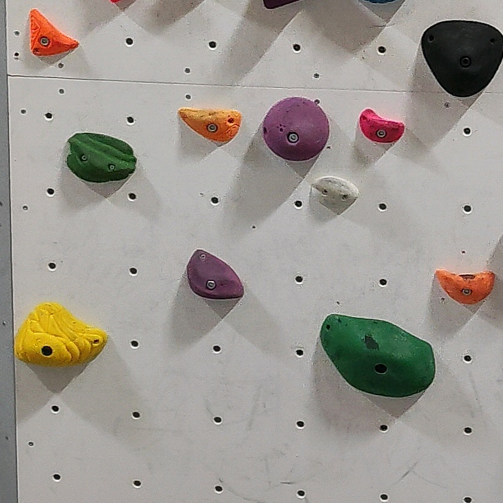

# Image Tilling

### For Segmentation AI Training

Tile one image into multiple images with associated labels

Take one image in input and return multiple images and labels as output

    Input Labels: YOLO Format

Feel free to improve this little script

## Potential Idee of Improvement 

Make a variant in tile image, like in Roboflow, add filters, rotate the image, degradation etc....

Add more Supported Label Format

## Process

1. Create a file with a label of the original image converted from percentage to pixels  
2. Iterate every element in the converted label file and keep only elements present in the future tile  
3. Create each tile, adjusting the origin of elements to fit the new tile 
4. Convert tiled Label file back to Yolo Format
4. Show image with element border

# Example

    

        <h3>Original Image</h3> 
        
    

    

        <h3>Tiled Image</h3> 
        
    

    

        <h3>Tiled Image with Polygons</h3> 
        
    

